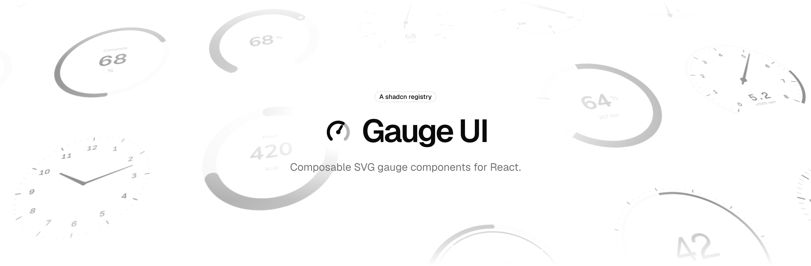

<picture>
  <source media="(prefers-color-scheme: dark)" srcset=".github/assets/header-dark.png">
  <source media="(prefers-color-scheme: light)" srcset=".github/assets/header-light.png">
  
</picture>

# gauge-ui

Composable SVG gauge primitives for React, distributed as a [shadcn](https://ui.shadcn.com) registry. Design a gauge in the studio, copy the code, and own the source in your project. No runtime dependencies beyond React and the shadcn `cn` helper.

## Install

```bash
npx shadcn@latest add https://gauge-ui.dev/r/gauge.json
```

Or register the namespace once in `components.json` and install by name:

```json
{
  "registries": {
    "@gauge-ui": "https://gauge-ui.dev/r/{name}.json"
  }
}
```

```bash
npx shadcn@latest add @gauge-ui/gauge
```

The files land in `components/gauge/`.

## Usage

```tsx
import {
  Gauge,
  GaugeArc,
  GaugeHub,
  GaugeNeedle,
  GaugeTickLabels,
  GaugeTicks,
  GaugeTrack,
  GaugeValue,
  GaugeZones,
  zoneColor,
} from "@/components/gauge"

const zones = [
  { to: 60, color: "#22c55e" },
  { to: 80, color: "#f59e0b" },
  { to: 100, color: "#ef4444" },
]

export function Speed({ value }: { value: number }) {
  return (
    <Gauge value={value} min={0} max={100} startAngle={40} endAngle={320}>
      <GaugeTrack width={14} />
      <GaugeZones zones={zones} width={14} />
      <GaugeArc width={14} color={zoneColor(zones, value, "currentColor")} />
      <GaugeTicks count={10} />
      <GaugeTickLabels count={5} />
      <GaugeNeedle style="pointer" />
      <GaugeHub />
      <GaugeValue decimals={0} />
    </Gauge>
  )
}
```

`Gauge` owns the domain and geometry. Every child reads value, angles and radius from context and positions itself against the reference radius, so parts can be added, removed or reordered freely. Angles are measured clockwise from six o'clock.

| Primitive | Draws |
| --- | --- |
| `GaugeTrack` | Background arc across the whole sweep |
| `GaugeArc` | Filled arc anchored at `from`, growing either way to the current value or `to`; `reverse` grows it back from the end, `wrap` carries it past the seam of a closed ring |
| `GaugeStack` | The value arc split into parts that sweep as one, by `weight` shares or fixed `to` cutoffs |
| `GaugeZones` | Coloured bands between zone cutoffs |
| `GaugeTicks` | Evenly spaced tick marks |
| `GaugeMarks` | Marks at arbitrary values, or at the `count` equal cuts of the domain |
| `GaugeTickLabels` | Numeric, compass or clock labels along the arc |
| `GaugeNeedle` | Line, pointer, compass or arrow needle |
| `GaugeHub` | Centre cap for the needle |
| `GaugeDot` | A disc riding the arc at the current value, with an optional `halo` to stand it off a band |
| `GaugeTooltip` | An HTML tooltip shown on hover, pinned to the value, the pointer or a fixed spot on the dial: the value with a label and unit by default, or any content you give it |
| `GaugeValue` | Formatted current value |
| `GaugeText` | Free text at any position, for units and titles |
| `GaugeInset` | A whole gauge nested inside another, at its own scale |
| `GaugeControl` | Wraps a gauge as an accessible slider: drag round the ring, turn the face with `knob`, or use the keyboard to set its value |

`Gauge` and `GaugeInset` also take `wrap`, which treats the domain as circular so a heading animates the shortest way round, and `rotate`, which turns the whole scale under a fixed pointer the way a compass card turns.

Helpers `zoneColor`, `zoneCutoffs`, `compassLabel`, `clockLabel`, `clockTime`, `durationLabel` and `fadeColor` are exported from the same module and are what the studio's generated code uses.

## Tooltips

`GaugeTooltip` is an HTML tooltip that shows while the pointer is over the gauge. By default it reads the value, with an optional `label` above it and `unit` after it, styled like the shadcn tooltip.

```tsx
<GaugeTooltip label="Used" unit="GB" decimals={1} />
```

`position` decides what it is pinned to:

| `position` | Pinned to |
| --- | --- |
| `value` | The arc at the current value, or at `at` when given. The default |
| `pointer` | The cursor, following it round the gauge |
| `center` | The middle of the dial |
| `top`, `right`, `bottom`, `left` | The middle of that edge of the box round the sweep |
| `top-left`, `top-right`, `bottom-left`, `bottom-right` | That corner of the same box |

`side` sets which way the bubble stands off that point: `top`, `right`, `bottom`, `left` or `center`. The default, `auto`, points outward along the radius at the value, so the bubble swings round as the value moves. It sits above the pointer, centres on the centre, and points away from the dial at an edge or corner. `offset` moves the point in or out from the reference radius in SVG units, as it does for arcs and dots, and `gap` is the room between the point and the bubble in CSS pixels. It also stays up while a press that started on the gauge is held, wherever the pointer goes, so it follows a drag on a `GaugeControl` and shows on touch screens, and while the gauge or the nearest focusable element round it, such as a `GaugeControl`, has keyboard focus. Pass `open` to hold it open, or shut, instead of following hover, presses and focus.

The bubble avoids the edges of the viewport without leaving its point. When it would cross an edge, it flips to the other side of the point if that side has more room. If it still crosses the left or right edge, it slides sideways, but only as far as it keeps overlapping the point. It never slides up or down, so a tooltip whose gauge is below the fold stays with it and scrolls into view alongside it. `collisionPadding` is the room kept clear of the edge, 8 pixels by default, and `avoidCollisions={false}` turns this off.

Children replace the default content with any HTML. Pass a function to get the value being shown, animated frame by frame, and `className` to restyle the bubble:

```tsx
<GaugeTooltip position="pointer" className="bg-popover text-popover-foreground">
  {(v) => (
    <div className="flex items-center gap-2">
      <span className="size-2 rounded-full" style={{ background: zoneColor(zones, v, "gray") }} />
      {v < 60 ? "Normal" : "High"} · {v.toFixed(0)}°
    </div>
  )}
</GaugeTooltip>
```

The bubble is portalled to `document.body` and placed through the SVG's screen transform. The gauge never clips it, and it keeps its CSS size however the gauge, or an inset it sits in, is scaled. Hover is taken over the whole `<svg>`, so a tooltip inside a `GaugeInset` shows when the pointer is anywhere over the host gauge. The entrance animation uses the `tw-animate-css` classes that shadcn projects already include.

## Nested gauges

`GaugeInset` is a second gauge drawn inside the first: a fuel dial under a speedometer, a ring inside a ring. It takes its own value and domain and publishes the same context `Gauge` does, so every primitive works inside it unchanged.

```tsx
<Gauge value={speed} min={0} max={240} startAngle={40} endAngle={320}>
  <GaugeTicks count={12} />
  <GaugeNeedle style="pointer" />
  <GaugeHub />
  <GaugeInset
    value={fuel}
    y={144}
    scale={0.28}
    min={0}
    max={100}
    startAngle={90}
    endAngle={270}
  >
    <GaugeTrack width={26} />
    <GaugeArc width={26} />
  </GaugeInset>
</Gauge>
```

It draws in the host gauge's coordinate system rather than a viewport of its own, so it takes no `padding` or `fit`. `x` and `y` place its centre in the host's SVG units, and `scale` sizes the whole thing at once: strokes, ticks and text shrink with the dial, so parts meant to be read at a quarter size are worth drawing heavier than they would be at full size. Insets can be stacked for concentric rings, and each one animates its own value.

The Speed & fuel, Nested rings and System templates in the studio are built this way. The studio edits every gauge in a composition: the chips above the value slider pick which one the panels, the slider and the play modes are pointed at, and the same row adds and removes them. An inset's Gauge panel trades `padding`, `fit` and the stage colour for where it sits and how big it is drawn. The generated code takes a prop per gauge.

## Animation

Value changes are instant by default. Pass `transition` to `Gauge` and every part that reads the value, including the arc, needle and value text, animates together. No animation library is involved; the gauge steps its own spring or tween per frame and snaps when the viewer prefers reduced motion.

```tsx
// A gentle spring with the default settings
<Gauge value={value} transition>

// Tune the spring by feel
<Gauge value={value} transition={{ type: "spring", visualDuration: 0.4, bounce: 0.25 }}>

// Or by physics, which takes precedence when given
<Gauge value={value} transition={{ type: "spring", stiffness: 120, damping: 14, mass: 1 }}>

// A timed tween with a named curve, cubic-bezier points, or your own function
<Gauge value={value} transition={{ type: "tween", duration: 0.6, ease: "easeOut" }}>
<Gauge value={value} transition={{ type: "tween", duration: 0.6, ease: [0.22, 1, 0.36, 1] }}>

// Sweep in from the minimum on mount
<Gauge value={value} initialValue={0} transition>
```

| Option | Applies to | Meaning |
| --- | --- | --- |
| `visualDuration` | spring | Seconds the spring visibly takes to arrive. Default 0.5 |
| `bounce` | spring | 0 settles without overshoot, 1 rings freely. Default 0.1 |
| `stiffness`, `damping`, `mass` | spring | Raw physics. Defaults 100, 10 and 1 when any is set |
| `duration` | tween | Seconds. Default 0.5 |
| `ease` | tween | `linear`, `easeIn`, `easeOut`, `easeInOut`, `[x1, y1, x2, y2]` or `(t) => number`. Default `easeInOut` |

Inside custom primitives, `useGauge()` exposes both `value`, the animated figure being drawn this frame, and `target`, the value the gauge is heading for. The studio's Value panel has the same controls, and the code it generates carries your transition.

## Studio

This repository is also the site: a landing page at `/` and the studio at `/studio`. Run it locally with:

```bash
npm install
npm run dev
```

## Registry

`registry.json` at the repository root defines the single `gauge` item. `npm run registry:build` writes the installable JSON to `public/r/`, and the production build runs it automatically so the deployed site always serves the current source.

## License

[MIT](LICENSE)
